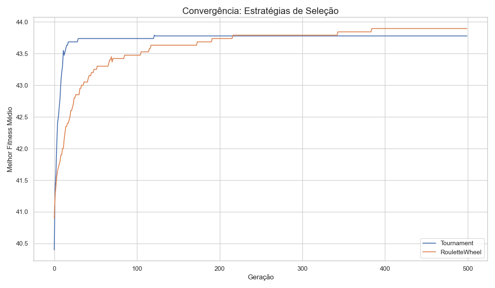
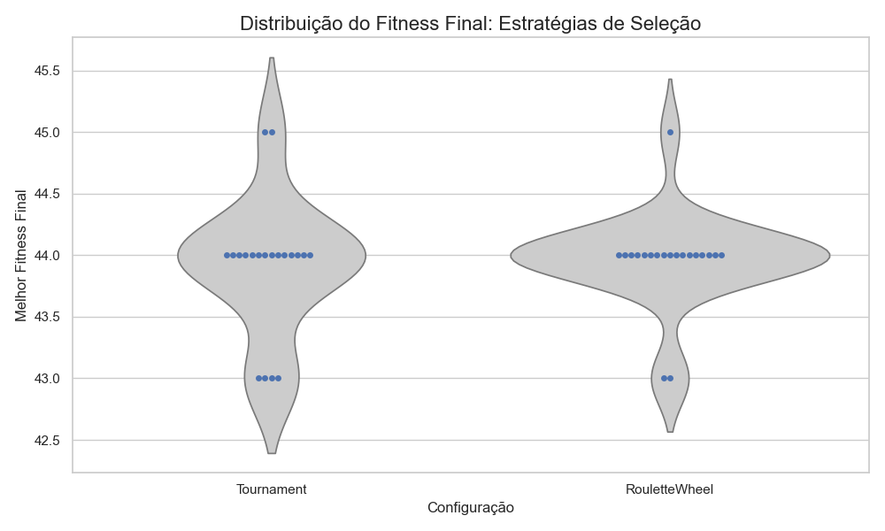
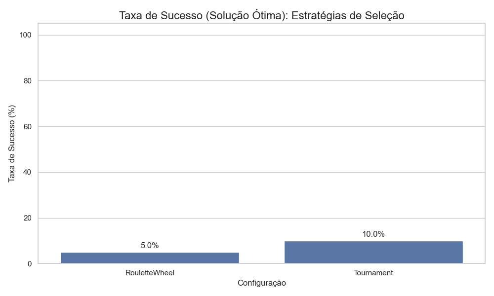
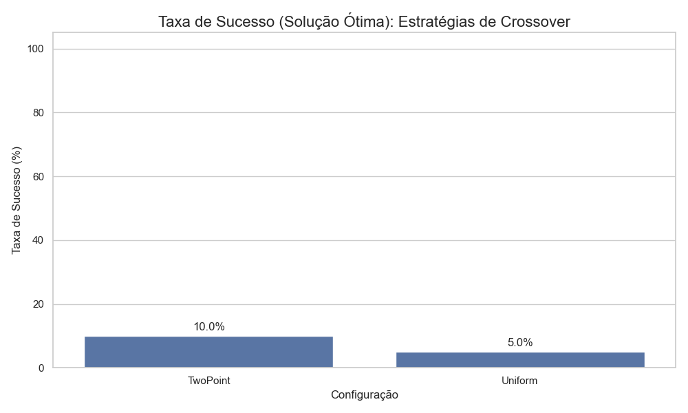
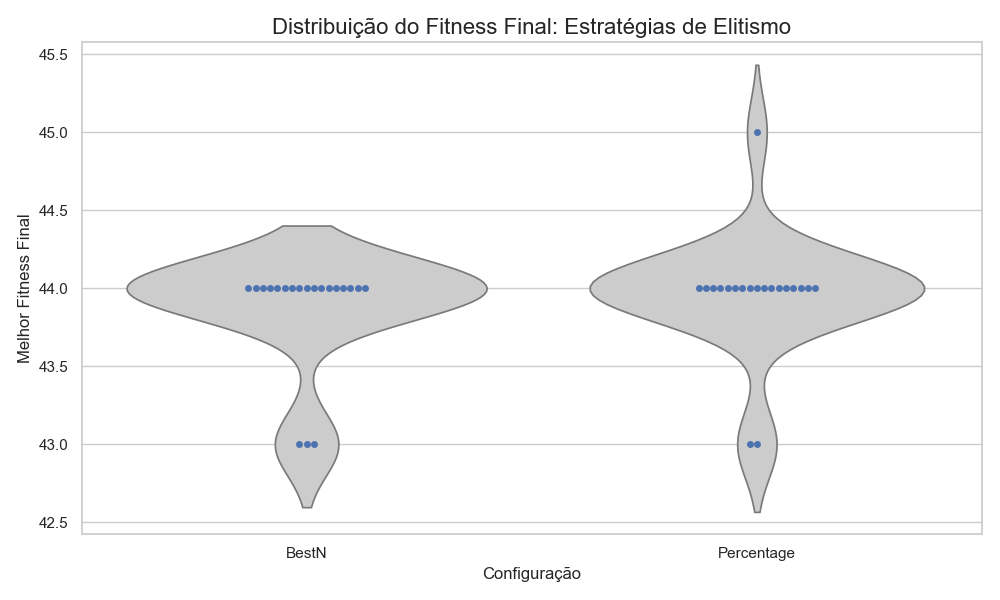
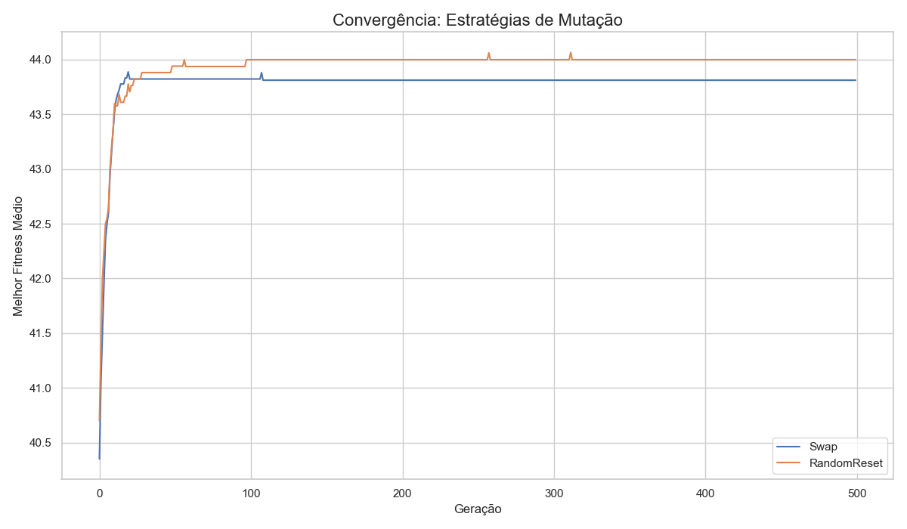
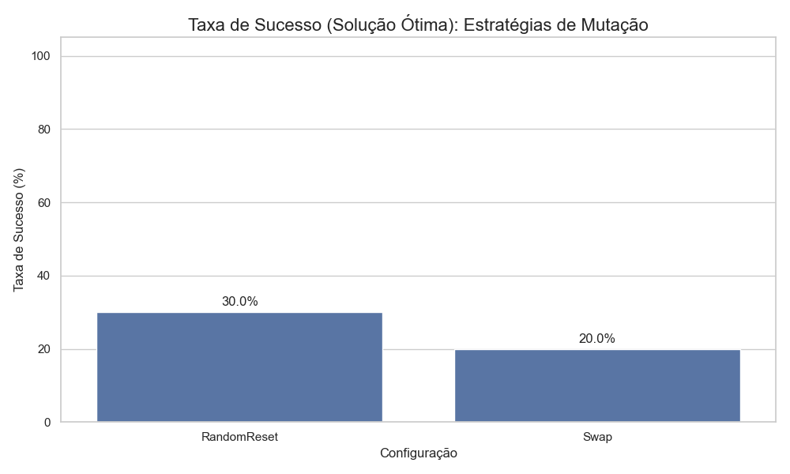

# Relatório Técnico: Algoritmos Genéticos para o Problema das N-Rainhas

**Curso:** Inteligência Artificial - 2025.1
**Professor:** Samy Sá
**Universidade:** Universidade Federal do Ceará - Campus de Quixadá

---

## 1. Implementação

Esta seção detalha os aspectos técnicos da implementação do projeto, as ferramentas utilizadas e as decisões de design da arquitetura do software.

### 1.1. Linguagem e Bibliotecas

-   **Linguagem:** Python 3.10
-   **Bibliotecas Principais:**
    -   `pandas`: Essencial para a manipulação de dados, leitura e escrita dos arquivos `.csv` contendo os resultados dos experimentos.
    -   `matplotlib` & `seaborn`: Utilizadas para a geração de gráficos estatísticos de alta qualidade, como os de convergência e os de distribuição, permitindo uma análise visual robusta.
    -   `tqdm`: Fornece barras de progresso interativas no terminal, melhorando a experiência do usuário durante as execuções, que podem ser demoradas.

### 1.2. Arquitetura do Código e Design

A base de código foi estruturada de forma modular, aderindo aos princípios **SOLID** de design orientado a objetos para promover flexibilidade e manutenibilidade.

-   **`core`**: Contém as classes fundamentais `Individual` (um cromossomo representando um tabuleiro) e `Population`.
-   **`problem`**: Isola a lógica específica do problema das N-Rainhas. A classe `NQueensFitness` é a única responsável por avaliar um indivíduo, desacoplando a definição do problema do algoritmo em si.
-   **`ga`**: Contém o motor `GeneticAlgorithm`. Sua arquitetura é baseada no **Padrão de Projeto Strategy**, sendo inicializado com objetos de estratégia para seleção, cruzamento, mutação e elitismo. Isso respeita o **Princípio Aberto/Fechado**, pois novas estratégias podem ser adicionadas sem modificar o motor principal do AG.
-   **`main.py`**: Serve como o orquestrador dos experimentos, configurando e executando as diferentes variações do AG conforme a especificação do trabalho.
-   **`plotter.py`**: Script dedicado à análise pós-experimento, responsável por ler os dados brutos dos arquivos `.csv` e gerar as visualizações gráficas.

---

## 2. Design dos Algoritmos

Esta seção justifica as escolhas de design para os componentes do Algoritmo Genético e como eles se aplicam ao problema das N-Rainhas.

### 2.1. Representação do Indivíduo e Função de Fitness

-   **Representação:** Um indivíduo (cromossomo) é representado por um vetor de `n` inteiros. O índice `i` do vetor representa a coluna, e o valor `s[i]` representa a linha onde a rainha daquela coluna está posicionada. Esta representação já previne ataques verticais.
-   **Função de Fitness:** O objetivo é minimizar o número de pares de rainhas em conflito. Como os AGs canonicamente maximizam o fitness, a função foi definida para **maximizar o número de pares de rainhas que não se atacam**. O número total de pares em um tabuleiro `n x n` é $N_{total} = \frac{n(n-1)}{2}$. A função de fitness calcula o número de ataques, $N_{ataques}$, e o fitness final é:
    $$\text{fitness} = N_{total} - N_{ataques}$$
    Uma solução perfeita para N=10 atinge o fitness máximo de 45.

### 2.2. Variações de Operadores e Combinações

O design flexível permite 16 combinações de algoritmos distintas a partir dos operadores implementados.

-   **Seleção (2):** `TournamentSelection`, `RouletteWheelSelection`.
-   **Cruzamento (2):** `UniformCrossover`, `TwoPointCrossover`.
-   **Mutação (2):** `SwapMutation`, `RandomResettingMutation`.
-   **Elitismo (2):** `BestNElitism`, `PercentageElitism`.

### 2.3. Parte 0: Escolha de Parâmetros Numéricos

Antes dos experimentos comparativos, foi realizada uma etapa de ajuste para encontrar um conjunto de parâmetros numéricos de base que oferecesse um bom equilíbrio entre qualidade da solução e tempo de execução para N=10. Os parâmetros escolhidos foram:
-   **Tamanho da População:** 100
-   **Número de Gerações:** 500
-   **Taxa de Mutação:** 5%
-   **Elitismo:** `BestNElitism` com N=2 ou `PercentageElitism` com 10%.
-   **Tamanho do Torneio:** 3

### 2.4. Justificativa das Estratégias Utilizadas

A escolha das estratégias para cada operador genético foi baseada em abordagens clássicas e eficientes, amplamente documentadas na literatura, para permitir uma comparação clara entre diferentes mecanismos de pressão seletiva e exploração do espaço de busca.

-   **Seleção:**
    -   **`RouletteWheelSelection` (Roleta):** Foi escolhida por ser uma das técnicas de seleção mais fundamentais. Ela serve como um excelente baseline, mas pode sofrer de convergência prematura.
    -   **`TournamentSelection` (Torneio):** Foi escolhida como uma alternativa robusta à roleta, que reduz a chance de domínio por um único indivíduo e permite um controle mais fino da pressão seletiva.

-   **Cruzamento (Crossover):**
    -   **`UniformCrossover` (Uniforme):** Foi escolhido por promover uma alta taxa de mistura entre os genes dos pais, o que pode ser útil para escapar de ótimos locais.
    -   **`TwoPointCrossover` (Dois Pontos):** Foi escolhido para testar a hipótese de que preservar blocos de construção (schemas) menores e mais coesos pode ser benéfico.

-   **Mutação:**
    -   **`SwapMutation` (Troca):** Esta estratégia foi escolhida por ser uma forma simples de mutação que reordena a informação genética existente sem introduzir novos valores.
    -   **`RandomResettingMutation` (Reset Aleatório):** Foi escolhida como uma alternativa que introduz maior diversidade na população, permitindo que o algoritmo explore novas áreas do espaço de busca.

-   **Elitismo:**
    -   **`BestNElitism` (Melhores N):** Implementa o conceito de elitismo em sua forma mais pura: a garantia de que os melhores indivíduos não serão perdidos.
    -   **`PercentageElitism` (Percentual):** Foi escolhido para testar uma forma de elitismo que escala com o tamanho da população, aumentando a pressão seletiva.

---

## 3. Experimentação

Esta seção apresenta a análise dos resultados obtidos nos experimentos, com base nos gráficos e dados gerados. Todos os experimentos de comparação (Partes 1-4) foram executados 20 vezes para N=10.

### Parte 1: Variações do Parâmetro de Seleção

-   **Análise dos Resultados:** O gráfico de convergência mostra que a `TournamentSelection` é mais eficiente, atingindo um fitness médio superior em menos gerações. A análise da taxa de sucesso confirma essa superioridade: a `TournamentSelection` encontrou a solução ótima com o dobro da frequência da `RouletteWheelSelection` (10% vs 5%).
-   **Conclusão:** A **`TournamentSelection` é a estratégia vencedora clara**, sendo mais rápida e robusta.

### Parte 2: Variações do Parâmetro de Crossover

-   **Análise dos Resultados:** Os gráficos de convergência e distribuição de fitness mostram que ambas as estratégias (`Uniform` e `TwoPoint`) são quase idênticas em performance, sendo rápidas e consistentes. A taxa de sucesso apresentou uma vantagem para o `TwoPoint` (10% vs 5%).
-   **Conclusão:** Ambas as estratégias são eficazes, com uma **ligeira vantagem em robustez para o `TwoPointCrossover`**.

### Parte 3: Variações do Parâmetro de Elitismo

-   **Análise dos Resultados:** O `PercentageElitism` (com mais elites) converge mais rápido e é mais consistente. Além disso, foi o único que conseguiu encontrar a solução ótima, com uma taxa de sucesso de 5%, enquanto o `BestNElitism` não obteve sucesso.
-   **Conclusão:** A estratégia **`PercentageElitism` se mostrou superior**, pois não só foi mais rápida, mas também a única capaz de encontrar a solução ótima, indicando que uma maior pressão seletiva foi benéfica nesta série de testes.

### Parte 4: Variações do Parâmetro de Mutação

-   **Análise dos Resultados:** A `RandomResettingMutation` demonstrou uma convergência ligeiramente mais rápida e atingiu um platô de fitness médio superior. Mais importante, sua taxa de sucesso foi de 30%, superando a `SwapMutation` que obteve 20%.
-   **Conclusão:** A **`RandomResettingMutation` é a estratégia vencedora**, sendo mais eficiente e significativamente mais eficaz em encontrar a solução ótima.

### Parte 5: Tamanho Máximo Viável do Problema

-   **Análise dos Resultados:** O gráfico de escalabilidade (Tempo vs. N) mostra um esperado aumento exponencial no tempo de execução para todas as variações. O gráfico de tempo total resume o custo computacional, destacando a variação com `TwoPointCrossover` como a mais eficiente no geral, enquanto a com `RandomResetMut` foi a mais lenta. O tempo total do experimento foi de 10.51 minutos, atendendo ao requisito do projeto.
-   **Conclusão:** O framework é eficaz para instâncias de até **N=35-40**. Dentre as estratégias campeãs, a que utiliza o **`TwoPointCrossover` demonstrou ser a mais escalável**.

---

## 4. Considerações Finais

O projeto demonstrou com sucesso a aplicação de Algoritmos Genéticos para o problema das N-Rainhas. A arquitetura modular permitiu uma experimentação robusta e a comparação detalhada de diferentes estratégias, gerando conclusões suportadas por evidências gráficas e de dados.

A principal conclusão é que a escolha dos operadores tem um impacto significativo no desempenho. Uma combinação de **`TournamentSelection`** (pela sua eficiência), **`TwoPointCrossover`** (pela sua escalabilidade) e **`RandomResettingMutation`** (pela sua alta taxa de sucesso) parece ser a mais promissora. A análise de elitismo mostrou que uma maior pressão seletiva (`PercentageElitism`) foi benéfica nesta série de testes.

Como trabalhos futuros, poderiam ser exploradas técnicas mais avançadas, como taxas de mutação adaptativas, representações de cromossomos baseadas em permutação ou a hibridização do AG com um algoritmo de busca local para refinar as soluções encontradas a cada geração.

## 5. Referências

* Russell, S., & Norvig, P. (2010). *Artificial Intelligence: A Modern Approach* (3rd ed.). Prentice Hall.