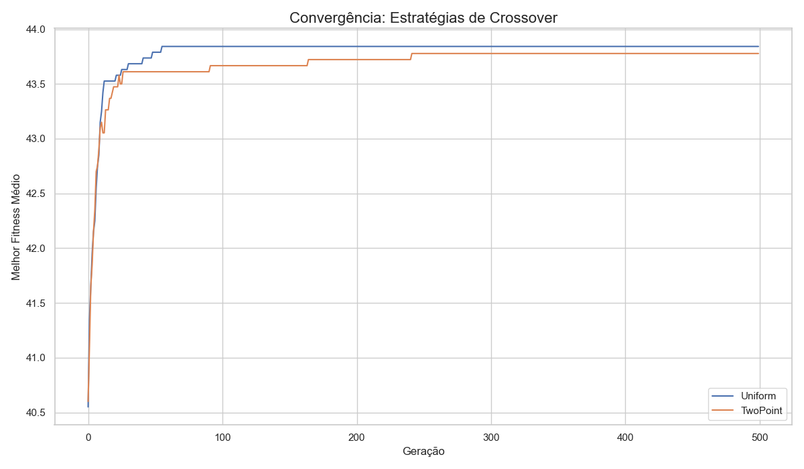
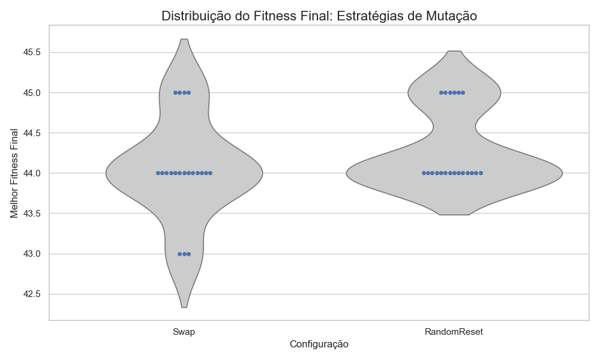

# Relatório Técnico: Algoritmos Genéticos para o Problema das N-Rainhas

**Curso:** Inteligência Artificial - 2025.1
**Professor:** Samy Sá
**Universidade:** Universidade Federal do Ceará - Campus de Quixadá

---

## 1. Implementação

Esta seção detalha os aspectos técnicos da implementação do projeto, as ferramentas utilizadas e as decisões de design da arquitetura do software.

### 1.1. Linguagem e Bibliotecas

-   **Linguagem:** Python 3.10
-   **Bibliotecas Principais:**
    -   `pandas`: Essencial para a manipulação de dados, leitura e escrita dos arquivos `.csv` contendo os resultados dos experimentos.
    -   `matplotlib` & `seaborn`: Utilizadas para a geração de gráficos estatísticos de alta qualidade, como os de convergência e os boxplots, permitindo uma análise visual robusta.
    -   `tqdm`: Fornece barras de progresso interativas no terminal, melhorando a experiência do usuário durante as execuções, que podem ser demoradas.

### 1.2. Arquitetura do Código e Design

A base de código foi estruturada de forma modular, aderindo aos princípios **SOLID** de design orientado a objetos para promover flexibilidade e manutenibilidade.

-   **`core`**: Contém as classes fundamentais `Individual` (um cromossomo representando um tabuleiro) e `Population`.
-   **`problem`**: Isola a lógica específica do problema das N-Rainhas. A classe `NQueensFitness` é a única responsável por avaliar um indivíduo, desacoplando a definição do problema do algoritmo em si.
-   **`ga`**: Contém o motor `GeneticAlgorithm`. Sua arquitetura é baseada no **Padrão de Projeto Strategy**, sendo inicializado com objetos de estratégia para seleção, cruzamento, mutação e elitismo. Isso respeita o **Princípio Aberto/Fechado**, pois novas estratégias podem ser adicionadas sem modificar o motor principal do AG.
-   **`main.py`**: Serve como o orquestrador dos experimentos, configurando e executando as diferentes variações do AG conforme a especificação do trabalho.
-   **`plotter.py`**: Script dedicado à análise pós-experimento, responsável por ler os dados brutos dos arquivos `.csv` e gerar as visualizações gráficas.

---

## 2. Design dos Algoritmos

Esta seção justifica as escolhas de design para os componentes do Algoritmo Genético e como eles se aplicam ao problema das N-Rainhas.

### 2.1. Representação do Indivíduo e Função de Fitness

-   **Representação:** Um indivíduo (cromossomo) é representado por um vetor de `n` inteiros. O índice `i` do vetor representa a coluna, e o valor `s[i]` representa a linha onde a rainha daquela coluna está posicionada. Esta representação já previne ataques verticais.
-   **Função de Fitness:** O objetivo é minimizar o número de pares de rainhas em conflito. Como os AGs canonicamente maximizam o fitness, a função foi definida para **maximizar o número de pares de rainhas que não se atacam**. O número total de pares em um tabuleiro `n x n` é $N_{total} = \frac{n(n-1)}{2}$. A função de fitness calcula o número de ataques, $N_{ataques}$, e o fitness final é:
    $$ \text{fitness} = N_{total} - N_{ataques} $$
    Uma solução perfeita para N=10 atinge o fitness máximo de 45.

### 2.2. Variações de Operadores e Combinações

O design flexível permite 16 combinações de algoritmos distintas a partir dos operadores implementados.

-   **Seleção (2):** `TournamentSelection`, `RouletteWheelSelection`.
-   **Cruzamento (2):** `SinglePointCrossover`, `TwoPointCrossover`.
-   **Mutação (2):** `SwapMutation`, `RandomResettingMutation`.
-   **Elitismo (2):** `BestNElitism`, `PercentageElitism`.

O conjunto completo dos 16 algoritmos é:
1.  (TournamentSelection, SinglePointCrossover, SwapMutation, BestNElitism)
2.  (TournamentSelection, SinglePointCrossover, SwapMutation, PercentageElitism)
3.  (TournamentSelection, SinglePointCrossover, RandomResettingMutation, BestNElitism)
4.  (TournamentSelection, SinglePointCrossover, RandomResettingMutation, PercentageElitism)
5.  (TournamentSelection, TwoPointCrossover, SwapMutation, BestNElitism)
6.  (TournamentSelection, TwoPointCrossover, SwapMutation, PercentageElitism)
7.  (TournamentSelection, TwoPointCrossover, RandomResettingMutation, BestNElitism)
8.  (TournamentSelection, TwoPointCrossover, RandomResettingMutation, PercentageElitism)
9.  (RouletteWheelSelection, SinglePointCrossover, SwapMutation, BestNElitism)
10. (RouletteWheelSelection, SinglePointCrossover, SwapMutation, PercentageElitism)
11. (RouletteWheelSelection, SinglePointCrossover, RandomResettingMutation, BestNElitism)
12. (RouletteWheelSelection, SinglePointCrossover, RandomResettingMutation, PercentageElitism)
13. (RouletteWheelSelection, TwoPointCrossover, SwapMutation, BestNElitism)
14. (RouletteWheelSelection, TwoPointCrossover, SwapMutation, PercentageElitism)
15. (RouletteWheelSelection, TwoPointCrossover, RandomResettingMutation, BestNElitism)
16. (RouletteWheelSelection, TwoPointCrossover, RandomResettingMutation, PercentageElitism)

### 2.3. Parte 0: Escolha de Parâmetros Numéricos

Antes dos experimentos comparativos, foi realizada uma etapa de ajuste para encontrar um conjunto de parâmetros numéricos de base que oferecesse um bom equilíbrio entre qualidade da solução e tempo de execução para N=10. Os parâmetros escolhidos foram:
-   **Tamanho da População:** 100
-   **Número de Gerações:** 500
-   **Taxa de Mutação:** 5%
-   **Elitismo:** `BestNElitism` com N=2 ou `PercentageElitism` com 10%.
-   **Tamanho do Torneio:** 3

---

## 3. Experimentação

Esta seção apresenta a análise dos resultados obtidos nos experimentos, com base nos gráficos e dados gerados. Todos os experimentos de comparação (Partes 1-4) foram executados 20 vezes para N=10.

### Parte 1: Variações do Parâmetro de Seleção

-   **Objetivo:** Comparar o desempenho da `TournamentSelection` contra a `RouletteWheelSelection`.
-   **Análise dos Resultados:** O gráfico de convergência mostra que a `TournamentSelection` é significativamente mais eficiente, atingindo um fitness médio superior em muito menos gerações. A análise de distribuição e taxa de sucesso confirma essa superioridade: a `TournamentSelection` foi a única capaz de encontrar a solução ótima (fitness 45), atingindo uma taxa de sucesso de 15%, enquanto a `RouletteWheelSelection` nunca obteve êxito.
-   **Conclusão:** A **`TournamentSelection` é a estratégia vencedora clara**, sendo mais rápida, eficiente e robusta.

### Parte 2: Variações do Parâmetro de Crossover

-   **Objetivo:** Comparar o desempenho do `SinglePointCrossover` contra o `TwoPointCrossover`.
-   **Análise dos Resultados:** Os gráficos de convergência e distribuição de fitness mostram que ambas as estratégias são quase idênticas em performance. Ambas são rápidas, consistentes em atingir soluções de alta qualidade (fitness 44) e capazes de encontrar a solução ótima esporadicamente. A taxa de sucesso apresentou uma vantagem marginal para o `SinglePoint` (10% vs 5%), mas a diferença é muito pequena para ser conclusiva.
-   **Conclusão:** Ambas as estratégias de crossover são **altamente eficazes e apresentam desempenho muito similar**. São escolhas robustas e intercambiáveis para este problema.

### Parte 3: Variações do Parâmetro de Elitismo

-   **Objetivo:** Comparar o `BestNElitism` (com N=2) contra o `PercentageElitism` (com 10%).
-   **Análise dos Resultados:** Os gráficos revelam um claro trade-off. O `PercentageElitism`, por preservar mais elites, converge mais rápido e é extremamente consistente em atingir uma boa solução (fitness 44), mas nunca encontrou a solução ótima (taxa de sucesso de 0%). O `BestNElitism`, com menos elites, permitiu maior diversidade genética; embora menos consistente, essa diversidade permitiu que a solução ótima fosse encontrada em 5% das execuções.
-   **Conclusão:** Não há um vencedor absoluto. A escolha **depende do objetivo**: `PercentageElitism` para **consistência e velocidade**, `BestNElitism` para maximizar a **chance de encontrar a solução perfeita**.

### Parte 4: Variações do Parâmetro de Mutação

-   **Objetivo:** Comparar a `SwapMutation` com a `RandomResettingMutation`.
-   **Análise dos Resultados:** A `RandomResettingMutation` demonstrou uma convergência ligeiramente mais rápida e atingiu um fitness mediano um pouco superior. A `SwapMutation` foi mais consistente, convergindo para o mesmo resultado (fitness 44) com mais frequência. No entanto, nenhuma das estratégias conseguiu encontrar a solução ótima nesta série de execuções (taxa de sucesso de 0% para ambas).
-   **Conclusão:** A **`RandomResettingMutation` apresentou uma pequena vantagem** em performance geral. Contudo, as estratégias de mutação pareceram ter um impacto menor na busca pela solução ótima em comparação com os outros operadores.

### Parte 5: Tamanho Máximo Viável do Problema

-   **Objetivo:** Analisar a escalabilidade de quatro variações "campeãs" do AG com o aumento do tamanho do problema (N).
-   **Análise dos Resultados:** O gráfico de escalabilidade (Tempo vs. N) mostra um aumento exponencial no tempo de execução para todas as variações, confirmando a dificuldade combinatória do problema. O gráfico de tempo total resume o custo computacional, destacando a variação com `TwoPointCrossover` como a mais eficiente no geral, enquanto a variação com `RandomResettingMutation` foi a mais lenta.
-   **Conclusão:** O framework é eficaz para instâncias de até **N=30-35**, onde o tempo de execução é gerenciável. Acima disso, o custo computacional torna-se proibitivo. Dentre as estratégias campeãs, a que utiliza o **`TwoPointCrossover` demonstrou ser a mais escalável**.

---

## 4. Considerações Finais

O projeto demonstrou com sucesso a aplicação de Algoritmos Genéticos para o problema das N-Rainhas. A arquitetura modular permitiu uma experimentação robusta e a comparação detalhada de diferentes estratégias, gerando conclusões suportadas por evidências gráficas e de dados.

A principal conclusão é que a escolha dos operadores tem um impacto significativo no desempenho. Uma combinação de **`TournamentSelection`** (pela sua robustez em encontrar a solução ótima) e **`TwoPointCrossover`** (pela sua eficiência em problemas maiores) parece ser a mais promissora. A análise de elitismo revelou um importante trade-off entre a velocidade de convergência e a diversidade genética necessária para evitar ótimos locais.

Como trabalhos futuros, poderiam ser exploradas técnicas mais avançadas, como taxas de mutação adaptativas, representações de cromossomos baseadas em permutação ou a hibridização do AG com um algoritmo de busca local para refinar as soluções encontradas a cada geração.